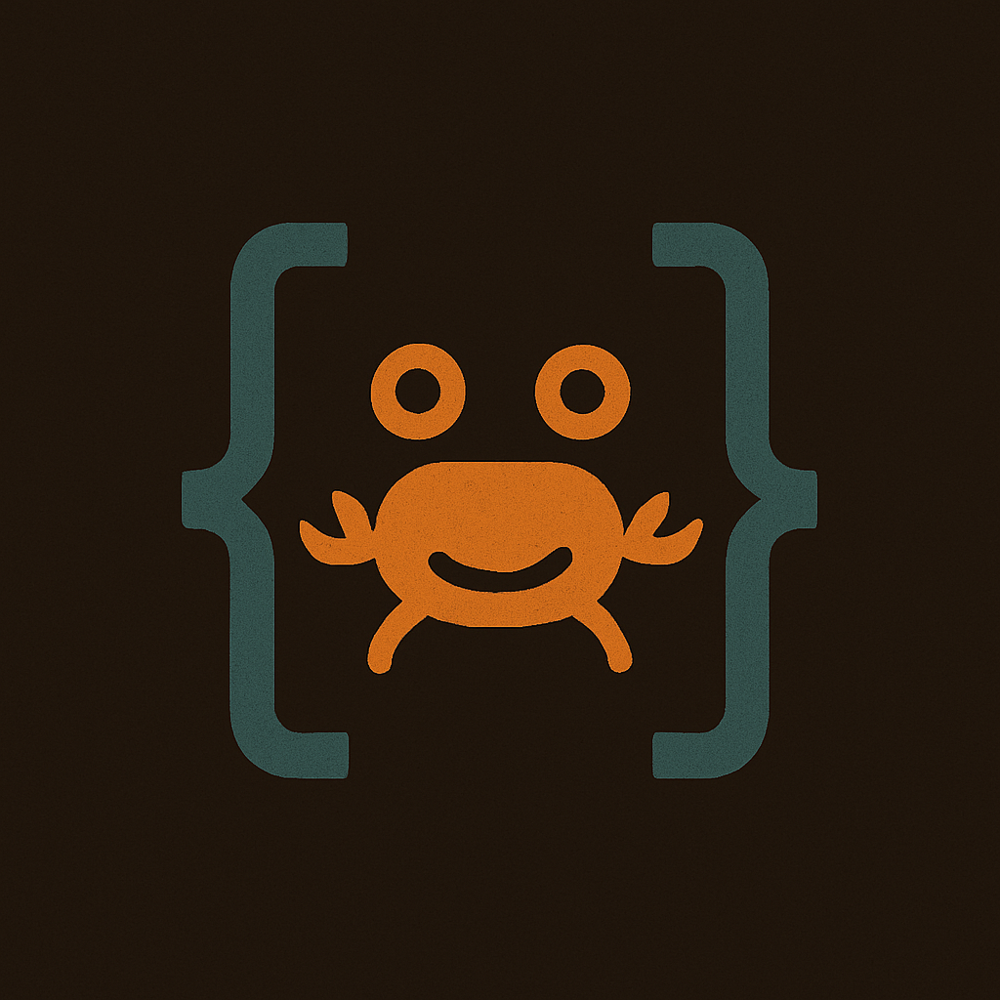

Learning Rust by Leetcode

    

## Getting Started

This repository contains my solutions to LeetCode problems implemented in Rust, serving as a practical way to learn Rust's ownership model, pattern matching, and other language features.

## Prerequisites

- [Rust](https://www.rust-lang.org/tools/install) (latest stable version recommended).
- Cargo (Rust's package manager, included with Rust installation).

## Contact

- [Github](https://github.com/MinLee0210)
- [LinkedIn](https://www.linkedin.com/in/minhle007/)
- [Email](mailto:minh.leduc.0210@gmail.com)

## License

This project is licensed under the MIT License - see the [LICENSE](LICENSE) file for details.
